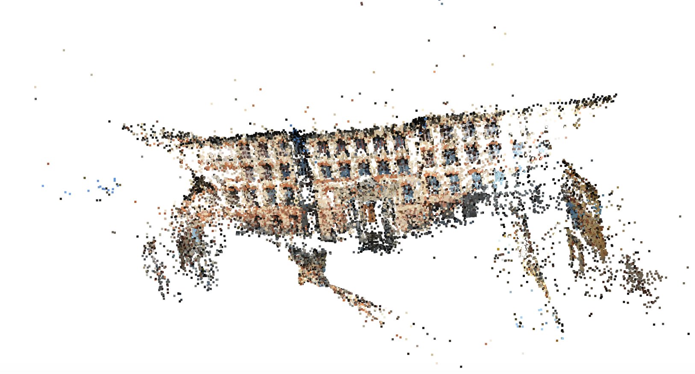
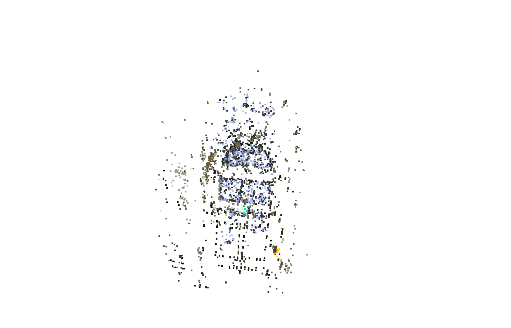

## Multi-View Structure From Motion (SfM)

This project implements a custom Structure from Motion (SfM) pipeline in Python that reconstructs 3D scenes from a sequence of 2D images. 

The pipeline supports both linear progression (sliding window over consecutive frames) and loop closure detection using spatial similarity across previously visited viewpoints.

The C++ version is also initialized with a build system using CMake and stub implementations for the main computational components(Main logic is WIP).
 

### Core Functionality
- Input: A sequence of 2D images, Camera Intrinsics, distortions (COLMAP format)

- Output: Reconstructed sparse 3D point cloud

Steps carried out:

- Feature matching between consecutive frames

- Relative pose estimation via Essential Matrix and recoverPose

- Triangulation of matched points into 3D space

- Pose chaining using K*[R|t] for initial frame.

- computePnP for pose estimation using 3D–2D correspondences

- Loop closure by matching current 2D keypoints with previously stored keypoints across all frames

- Point cloud accumulation for the final 3D scene

### Additional Steps to Consider:

- Implement a strong Bundle Adjustment using Least Squares technique for ex, to further strengthen the point cloud.

- Create a Mesh implementation in order to generate a 3D environment (or Use NeRF to generate a full scene)

- C++ Acceleration using OpenCV and Eigen for real-time SfM

### Tech Stack:

- Feature Extraction : SIFT
- Feature Matching : BF with KNN(k=2); Homography computation with RANSAC
- Pose Estimation: K*[R|t] -> computePnP(<prev_matched_3D_pts>,<corresponding_2D_pts>)
- Open3D for visualization.

### Sample Output:

### Acknowledgements

- Datasets - https://www.eth3d.net/